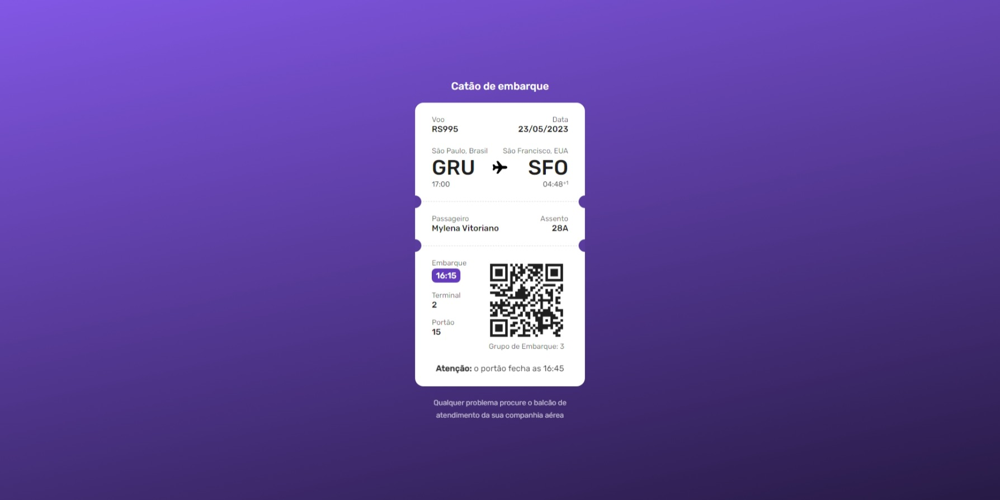

<h1 align="center"> Boarding Pass </h1>

    Cartão de Embarque
 

  <a href="#-tecnologias">Tecnologias</a>&nbsp;&nbsp;&nbsp;|&nbsp;&nbsp;&nbsp;
  <a href="#-projeto">Projeto</a>&nbsp;&nbsp;&nbsp;|&nbsp;&nbsp;&nbsp;
  <a href="#-layout">Layout</a>&nbsp;&nbsp;&nbsp;

 

  

## 🚀 Tecnologias

Esse projeto foi desenvolvido com as seguintes tecnologias:

- Next.js
- Styled-component

## 💻 Projeto

Projeto para simular um cartão de embarque de um voo. O objetivo desse projeto é totalmente educativo, para praticar programação.

## 🔖 Layout

Você pode visualizar o layout do projeto através [DESSE LINK](https://www.figma.com/file/zzv4HBwJtsHdvnATjdPDME/%23boraCodar---Desafio-6-(Community)?node-id=1%3A878&t=J2JznycRJE2kVVNV-0). É necessário ter conta no [Figma](https://figma.com) para acessá-lo.
